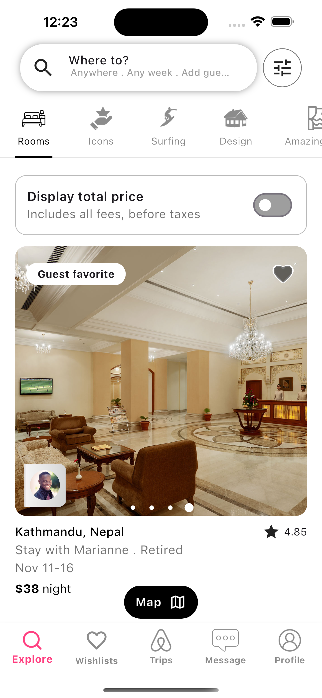
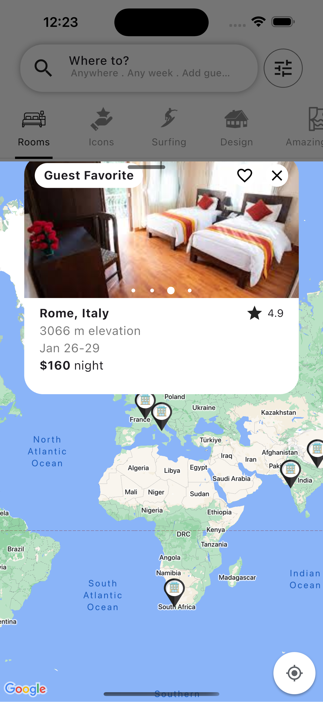
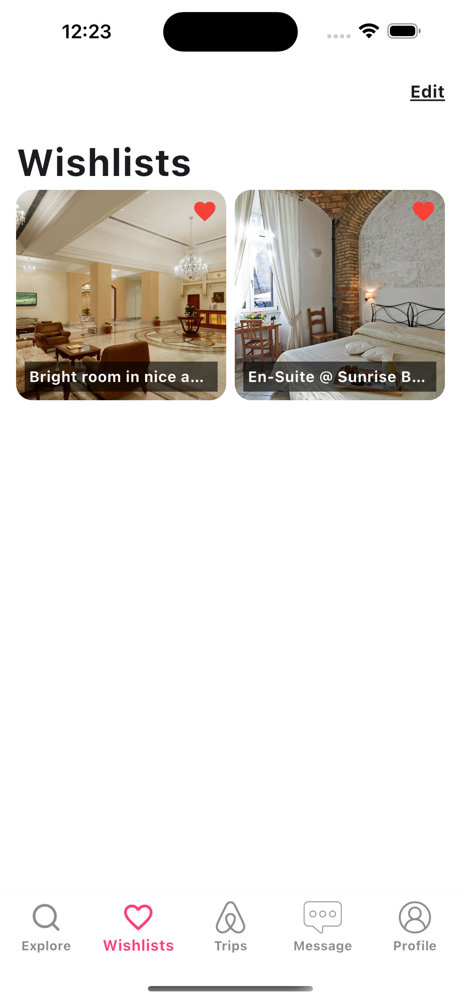
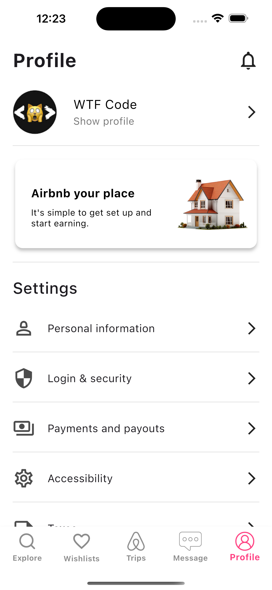
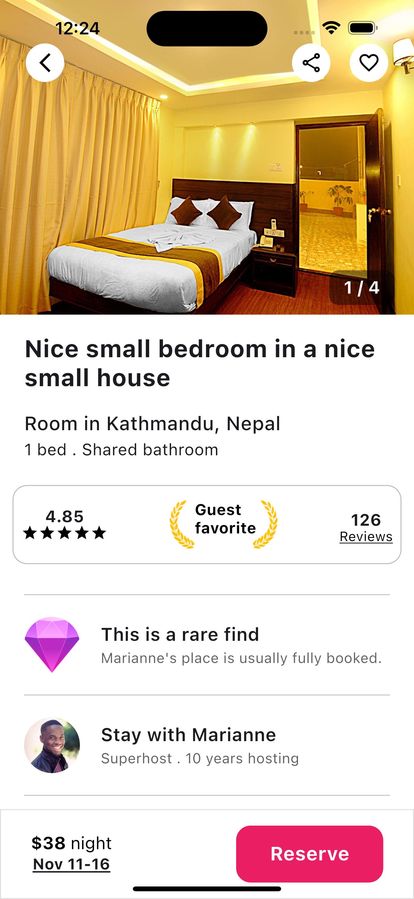
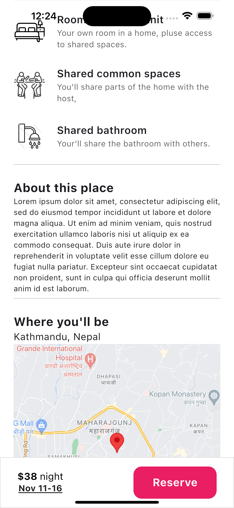

# airbnb_app_ui

In this Project, we’ll build an Airbnb app from scratch using Flutter, Firebase, Google Maps, and Provider! 🚀 Whether you're interested in mastering Flutter UI design or creating feature-rich applications, this tutorial covers it all. We’ll walk through how to integrate Firebase for backend functionality and Google Maps for location services, all while leveraging Provider for efficient state management.

You’ll know how to design a visually appealing Airbnb-like app with Flutter, handle real-time data with Firebase, implement interactive maps with Google Maps, and manage state using Provider. This project is perfect for developers who want to build complete apps while learning about the core technologies that power modern mobile applications.

## Screenshot

 help screen     

### App Description:

If you need a complete code:
